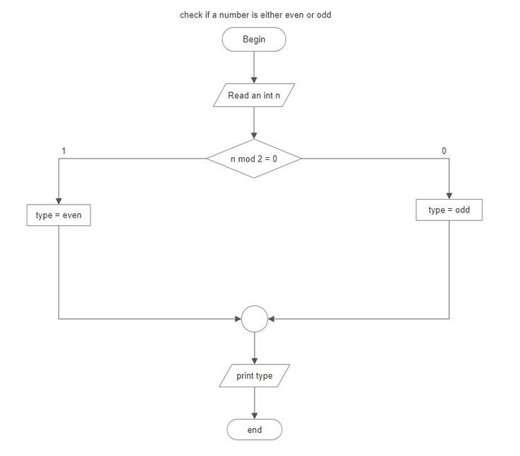

# Day 1 – Flowcharts

## What is a Flowchart?

A **flowchart** is a graphical representation of a process or algorithm using symbols and arrows to show the flow of steps.

It helps in visualizing how a problem is solved step by step.

---

## Why Do We Use Flowcharts?

Flowcharts are used to:

- Understand complex problems easily
- Plan logic before coding
- Improve problem-solving skills
- Communicate ideas clearly
- Debug and analyze processes

---

## Types of Flowcharts

### 1. System Flowchart
Represents the overall system, including data flow, inputs, outputs, and processes.

### 2. Program Flowchart
Represents the logic of a program step by step.

### 3. Process Flowchart
Represents a process or workflow in a system (used in industries and business processes).

---

## Basic Symbols Used in Flowcharts

- **Oval** → Start / End
- **Rectangle** → Process (calculation or instruction)
- **Parallelogram** → Input / Output
- **Diamond** → Decision (Yes/No condition)
- **Arrow** → Flow of control

---

## Steps to Design a Flowchart

1. **Understand the Problem**  
   Clearly define what needs to be solved.

2. **Identify Input, Process, Output (IPO)**  
   - Input → What data is required  
   - Process → What operations are performed  
   - Output → What result is expected  

3. **Choose Flowchart Type**  
   Decide whether it's system, program, or process flowchart.

4. **Map the Sequence of Steps**  
   Write the steps in order.

5. **Choose Appropriate Symbols**  
   Use standard symbols for clarity.

6. **Arrange Symbols Logically**  
   Maintain proper flow from top to bottom or left to right.

7. **Validate the Flowchart**  
   Check if the logic is correct and complete.

---

## Example: Flowchart to Check Even or Odd

---

## Real-World Applications of Flowcharts

- Software development (program logic)
- Banking systems (transaction flow)
- Manufacturing processes
- Business workflows
- Decision-making systems

---

## Practice Questions

1. Draw a flowchart to find the **sum of two numbers**.

2. Draw a flowchart to check whether a number is **positive or negative**.

3. Draw a flowchart to find the **largest of two numbers**.